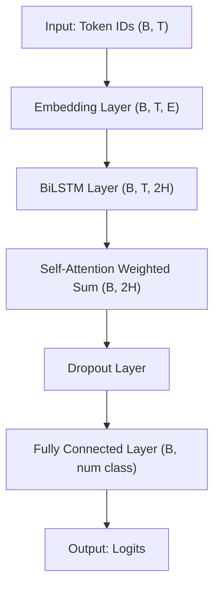
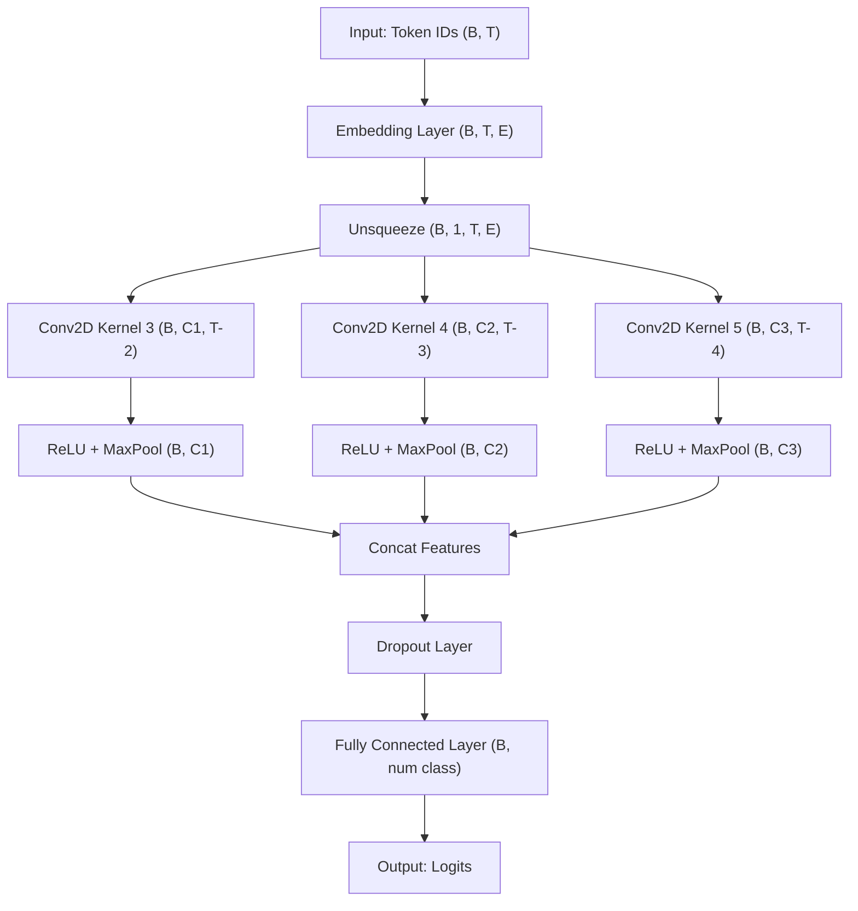
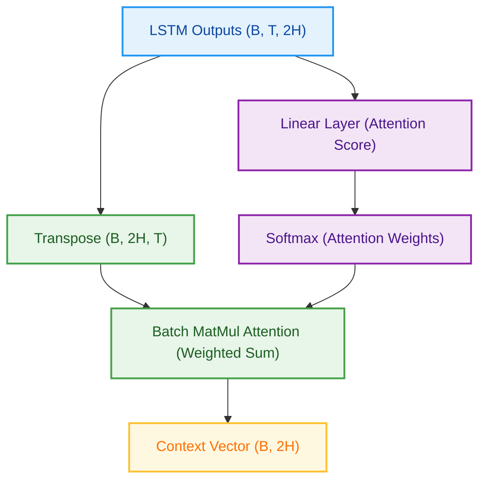

## 带注意力机制的BiLSTM

## TextCNN:

## 自注意力机制：

我发现能预测出积极样本的概率非常大，预测出消极的概率非常小，很多消极词都会误预测为积极，使用交叉熵损失函数，

## 数据集结构

## 对数据集的预处理

- **`like`** 情感出现次数最多，样本数量最大。
- 其次是 **`disgust`** 和 **`happiness`**。
- **`fear`** 情感的句子最少。
- 情感类别的分布是不均衡的，少数类别样本很少，可能会影响模型训练（**类别不平衡问题**）。

- 后续训练模型，这种分布不均可能导致模型倾向预测样本多的类别（比如总是预测成 `like`），可以考虑在训练时加权损失函数、过采样/欠采样等方法进行平衡处理。

句子长度分布：

- 大多数句子的长度集中在**10到30个字符**左右。
- 句子越长，出现次数越少，呈现**右偏分布**（long tail）。
- 超过100字符的长句非常少。

**数据清洗参考**：

- 过短的句子（比如 <5字符）可能信息量少，可考虑过滤。
- 极长句子（>128字符）可能超出模型最大长度，需要截断或丢弃。

**模型输入设计参考**：

- 根据这个分布，**最大长度设为64或128**，覆盖绝大多数句子，兼顾效果和效率。

### **正向情感词云图**（Word Cloud of Positive Emotion）

------

### 图的内容解释：

- 这张图展示的是：**在正向情感（positive）句子中，出现频率最高的词**。
- **词频越高，字体越大**，颜色和位置是随机的，增强可视化效果。

------

### 细节解读：

- 词频最高的词包括：
  - `我`、`了`、`有`、`我们`、`他`、`啊`、`是`、`都`、`今天`、`大家` 等等。
- 大量出现的是**代词、助词**（我、他、了、的），属于自然现象。
- 少量出现了**情感词**（比如：`喜欢`、`爱`、`开心`、`感谢`、`祝福`、`希望`）。

### 补充说明：

- 这种情况在**中文情感分析**中很常见，**高频功能词**会占据主导。
- 如果要更有意义的分析：
  - 可以**去掉停用词**（比如我、你、他、了、的）。
  - 只保留**动词、形容词**（真正有情感色彩的词）。

LSTM初始参数训练：

