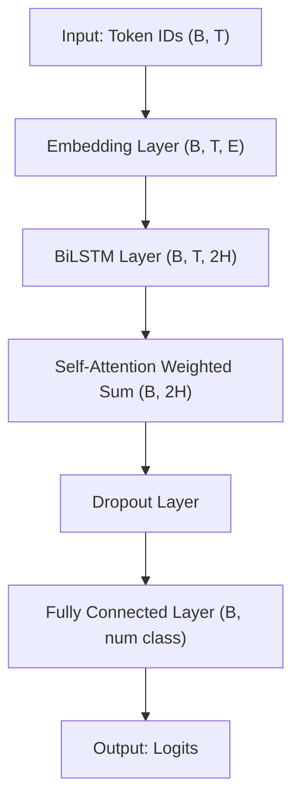
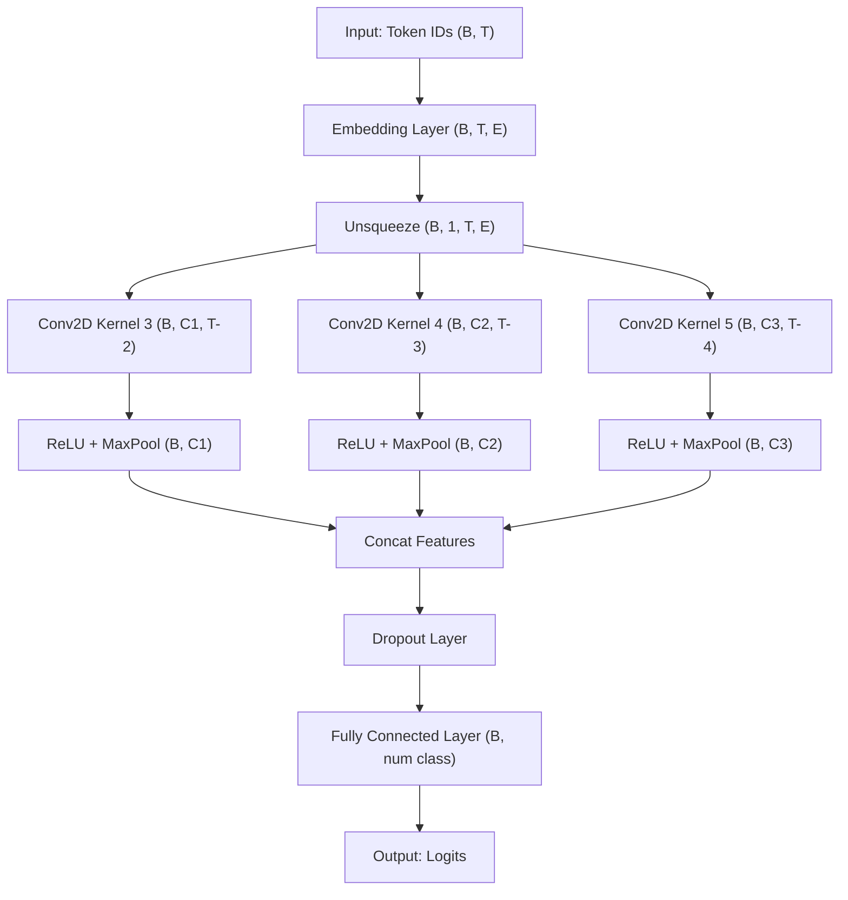
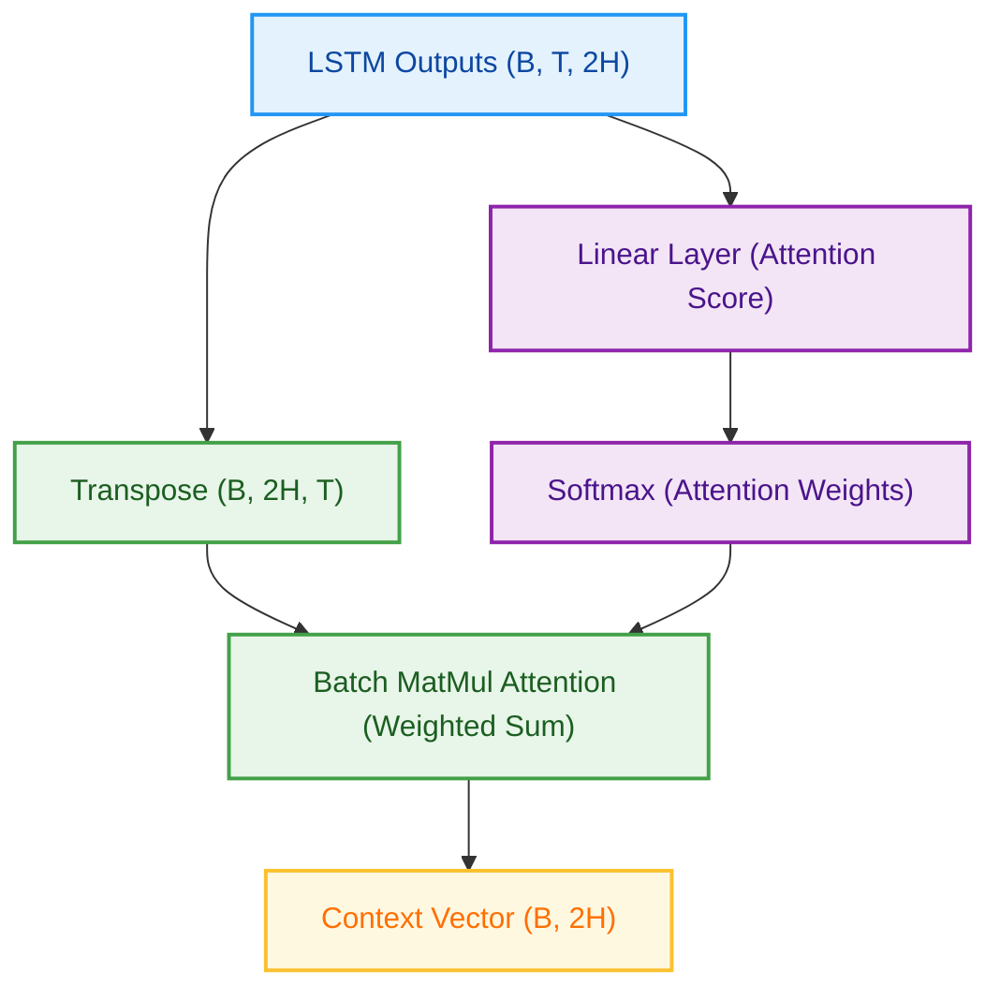

## 带注意力机制的BiLSTM

```mermaid
flowchart TD
    A["Input: Token IDs (B, T)"] --> B["Embedding Layer (B, T, E)"]
    B --> C["BiLSTM Layer (B, T, 2H)"]
    C --> D["Self-Attention Weighted Sum (B, 2H)"]
    D --> E["Dropout Layer"]
    E --> F["Fully Connected Layer (B, num class)"]
    F --> G["Output: Logits"]
```

## TextCNN:

```mermaid
flowchart TD
    A["Input: Token IDs (B, T)"] --> B["Embedding Layer (B, T, E)"]
    B --> C["Unsqueeze (B, 1, T, E)"]
    C --> D1["Conv2D Kernel 3 (B, C1, T-2)"]
    C --> D2["Conv2D Kernel 4 (B, C2, T-3)"]
    C --> D3["Conv2D Kernel 5 (B, C3, T-4)"]
    D1 --> E1["ReLU + MaxPool (B, C1)"]
    D2 --> E2["ReLU + MaxPool (B, C2)"]
    D3 --> E3["ReLU + MaxPool (B, C3)"]
    E1 --> F["Concat Features"]
    E2 --> F
    E3 --> F
    F --> G["Dropout Layer"]
    G --> H["Fully Connected Layer (B, num class)"]
    H --> I["Output: Logits"]

```

## 自注意力机制：

```mermaid
flowchart TD
    A["LSTM Outputs (B, T, 2H)"]
    A --> B["Linear Layer (Attention Score)"]
    B --> C["Softmax (Attention Weights)"]
    A --> D["Transpose (B, 2H, T)"]
    D --> E["Batch MatMul Attention (Weighted Sum)"]
    C --> E
    E --> F["Context Vector (B, 2H)"]

    %% 样式设定
    classDef input fill:#E3F2FD,stroke:#2196F3,stroke-width:2px,color:#0D47A1;
    classDef transform fill:#E8F5E9,stroke:#43A047,stroke-width:2px,color:#1B5E20;
    classDef attention fill:#F3E5F5,stroke:#8E24AA,stroke-width:2px,color:#4A148C;
    classDef output fill:#FFF8E1,stroke:#FBC02D,stroke-width:2px,color:#FF6F00;

    class A input;
    class B,C attention;
    class D,E transform;
    class F output;
```

我发现能预测出积极样本的概率非常大，预测出消极的概率非常小，很多消极词都会误预测为积极，使用交叉熵损失函数，

## 数据集结构

## 对数据集的预处理

